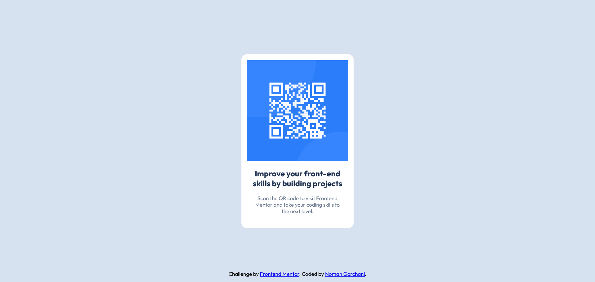

# Frontend Mentor - QR code component solution

This is my solution to the Frontend Mentor QR code component challenge.  
The purpose of this project was to practice building responsive card layouts using HTML and CSS.

---

## Table of contents

- [Overview](#overview)
  - [Screenshot](#screenshot)
  - [Links](#links)
- [My process](#my-process)
  - [Built with](#built-with)
  - [What I learned](#what-i-learned)
  - [Continued development](#continued-development)
  - [AI Collaboration](#ai-collaboration)
- [Author](#author)

---

## Overview

### Screenshot



---

### Links

- Solution URL: https://www.frontendmentor.io/
- Live Site URL: https://your-live-site-url.com

---

## My process

### Built with

- Semantic HTML5 markup
- CSS custom properties
- Flexbox
- Responsive design
- Mobile-first workflow

---

### What I learned

While building this project, I practiced:

- Using semantic HTML tags like `main` and `footer`
- Centering elements with Flexbox
- Creating responsive layouts
- Working with `max-width`
- Using HSL colors in CSS
- Improving spacing and alignment

Example of CSS I used:

```css
.container{
    margin-inline: auto;
    min-height: 100vh;
    justify-content: center;
    align-items: center;
    display: flex;
    flex-direction: column;
    max-width: 1440px;
}
```

I also learned how to properly structure a card component and keep the layout clean on smaller screens.

---

### Continued development

In future projects, I want to improve more in:

- CSS Grid
- Responsive layouts
- Better accessibility practices
- Writing cleaner and reusable CSS
- JavaScript interactivity

---

## Author

- Name - Noman
- Frontend Mentor - https://www.frontendmentor.io/
